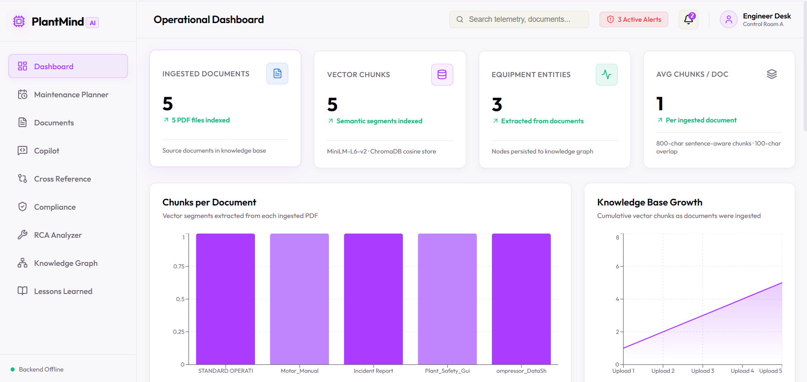
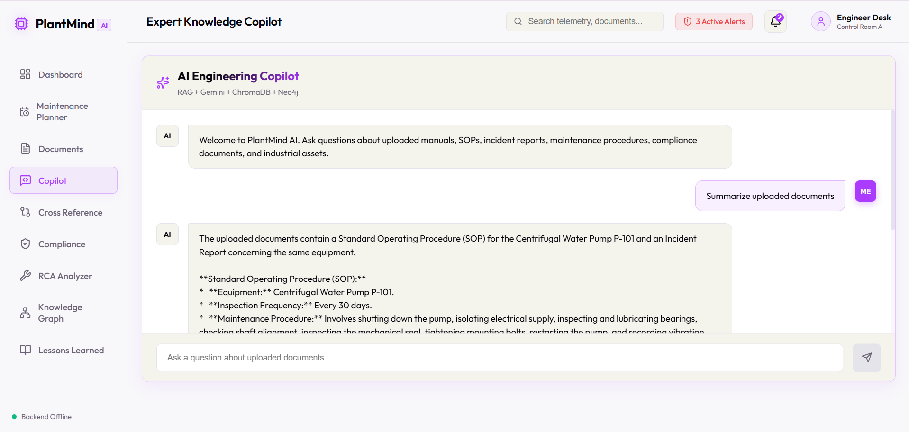
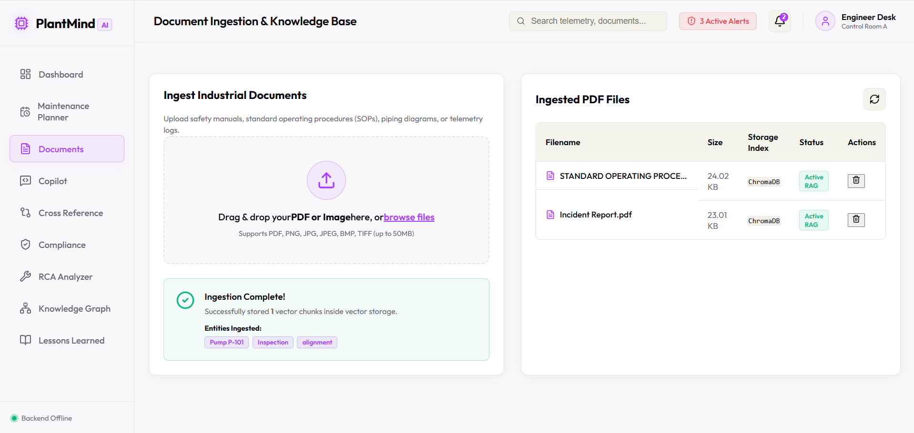
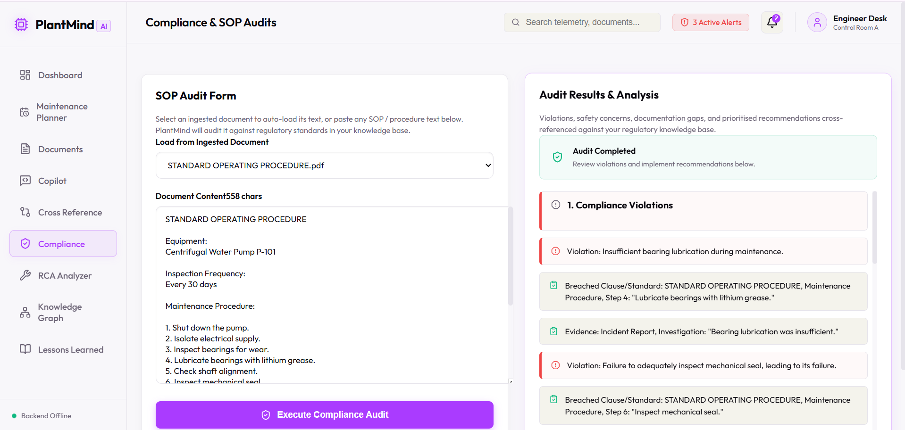
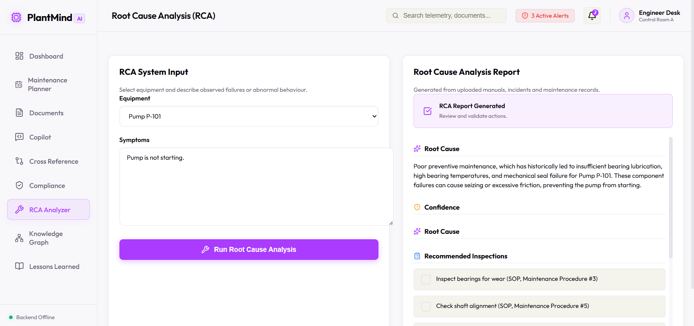
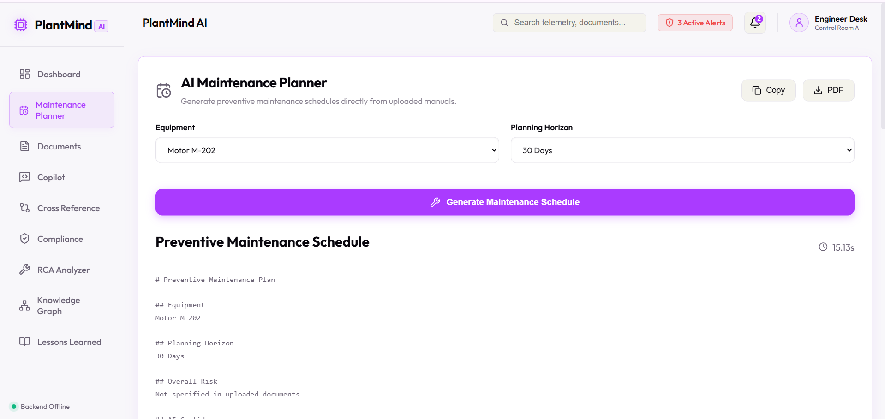
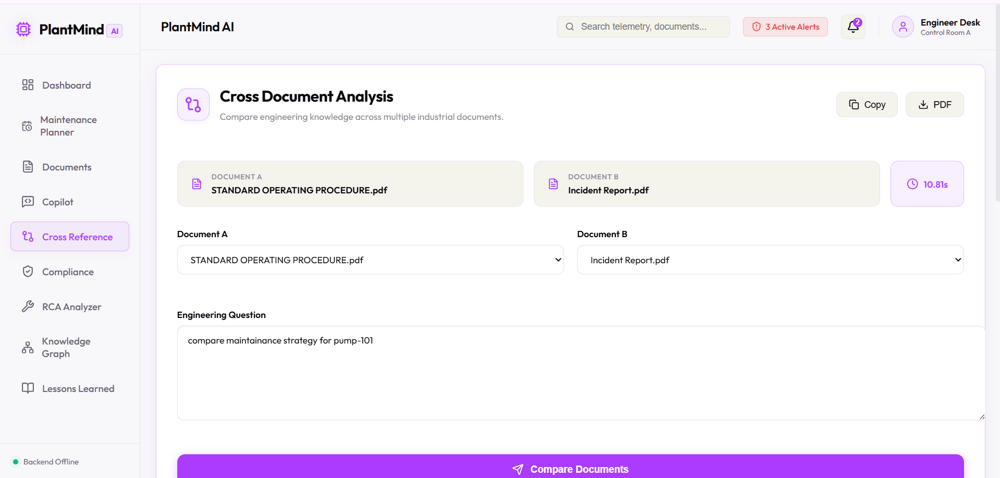
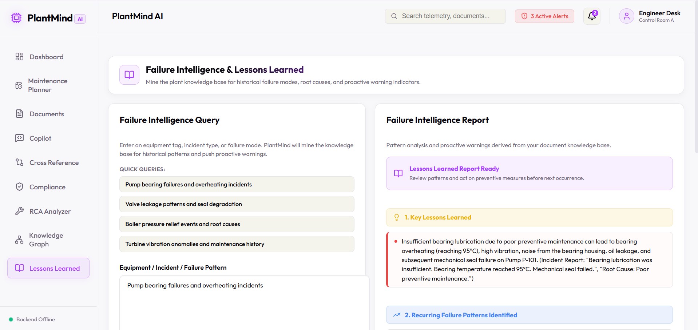

<div align="center">

# 🌿 PlantMind AI   
### AI-Powered Industrial Engineering Copilot

Transforming Industrial Documents into Actionable Engineering Intelligence using
**Retrieval-Augmented Generation (RAG), Knowledge Graphs, OCR, and Generative AI**


</div>
 
---

# 📖 Overview

Industrial engineers spend countless hours searching through maintenance manuals, Standard Operating Procedures (SOPs), incident reports, compliance documents, and equipment datasheets.

**PlantMind AI** transforms these disconnected documents into an intelligent engineering copilot capable of understanding, comparing, auditing, and reasoning over industrial knowledge.

Rather than acting as a simple chatbot, PlantMind performs **engineering-aware Retrieval-Augmented Generation (RAG)** using semantic search, OCR, vector embeddings, knowledge graphs, and Google's Gemini AI.

---

# 🚀 Key Features

## 📄 Intelligent Document Processing

- PDF ingestion
- OCR for scanned PDFs
- Image OCR (PNG, JPG, JPEG, BMP, TIFF)
- Automatic text extraction
- Intelligent chunking
- Vector embedding generation

---

## 🤖 AI Engineering Copilot

Ask engineering questions such as:

- Why did Pump P-101 fail?
- Explain this maintenance procedure.
- Which SOP step was skipped?
- What PPE is required?
- Summarize this manual.

Powered by:

- Retrieval-Augmented Generation (RAG)
- Google Gemini
- Semantic Search

---

## 🔍 Cross Document Intelligence

Compare multiple documents simultaneously.

Examples:

- SOP vs Incident Report
- Manual vs Datasheet
- Safety Guidelines vs SOP

Automatically identifies:

- Agreements
- Differences
- Missing Information
- Engineering Recommendations

---

## ⚙ Root Cause Analysis (RCA)

Analyze equipment failures using historical documents.

Outputs:

- Root Cause
- Supporting Evidence
- Corrective Actions
- Preventive Actions
- AI Confidence

---

## 📋 Compliance Auditor

Automatically audits industrial documentation against safety requirements.

Detects:

- Missing PPE
- Missing procedures
- Documentation gaps
- Safety violations
- Compliance recommendations

---

## 📈 Preventive Maintenance Planner

Generates AI-powered maintenance schedules including:

- Maintenance frequency
- Inspection plans
- Spare parts
- Required PPE
- Recommended tools
- Risk analysis

---

## 📚 Lessons Learned Generator

Learns from previous incidents and generates:

- Best Practices
- Preventive Measures
- Operational Improvements
- Engineering Recommendations

---

## 🧠 Knowledge Graph

Builds an engineering knowledge graph connecting:

- Equipment
- Components
- Incidents
- Procedures
- Documents

Powered by Neo4j.

---

## 🔎 Semantic Search

Uses Sentence Transformers + ChromaDB for semantic retrieval instead of keyword matching.

Supports:

- Natural language queries
- Context-aware search
- Source attribution

---

# 🏗 System Architecture

```
                        +-----------------------+
                        |     React Frontend    |
                        +-----------+-----------+
                                    |
                                    |
                                    ▼
                       +-------------------------+
                       |     FastAPI Backend     |
                       +-----------+-------------+
                                   |
         -------------------------------------------------
         |               |               |               |
         ▼               ▼               ▼               ▼
   Google Gemini     ChromaDB       Neo4j Graph      EasyOCR
      LLM           Vector Store     Knowledge        OCR Engine
                                         Graph
```

---

# 🛠 Tech Stack

## Frontend

- React
- TypeScript
- Vite
- Axios
- Recharts
- Lucide Icons

---

## Backend

- FastAPI
- Python
- Google Gemini API
- ChromaDB
- Neo4j
- EasyOCR
- Sentence Transformers
- PDF2Image
- PyPDF
- OpenCV

---

## Deployment

Frontend

- Vercel

Backend

- Railway

---

# 📂 Project Structure

```
PlantMind
│
├── frontend/
│     ├── pages/
│     ├── services/
│     ├── components/
│     └── assets/
│
├── backend/
│     ├── main.py
│     ├── rag.py
│     ├── extractor.py
│     ├── compliance.py
│     ├── maintenance.py
│     ├── lessons.py
│     ├── rca.py
│     ├── graph.py
│     └── requirements.txt
│
└── README.md
```

---

# 🌟 Example Workflow

```
Upload Industrial Documents
            │
            ▼
 OCR + Text Extraction
            │
            ▼
 Semantic Chunking
            │
            ▼
 Vector Embeddings
            │
            ▼
 ChromaDB Storage
            │
            ▼
 Knowledge Graph Generation
            │
            ▼
 Gemini RAG Reasoning
            │
            ▼
 Engineering Insights
```

---

# 💡 Example Use Cases

- Industrial Maintenance
- Manufacturing Plants
- Process Industries
- Oil & Gas
- Power Plants
- Chemical Industries
- Smart Factories
- Engineering Knowledge Management

---

# 📊 AI Capabilities

✔ Retrieval-Augmented Generation

✔ OCR

✔ Semantic Search

✔ Multi-document Reasoning

✔ Compliance Analysis

✔ Root Cause Analysis

✔ Maintenance Planning

✔ Lessons Learned

✔ Knowledge Graph

✔ Engineering Question Answering

---

# 🔒 Security

- Environment variables for API keys
- No hardcoded credentials
- Local vector storage
- Safe document processing

---

# 🚀 Getting Started

## Clone Repository

```bash
git clone https://github.com/yourusername/PlantMind.git

cd PlantMind
```

---

## Backend

```bash
cd backend

pip install -r requirements.txt

uvicorn main:app --reload
```

---

## Frontend

```bash
cd frontend

npm install

npm run dev
```

---

## Environment Variables

Create `.env`

```env
GEMINI_API_KEY=YOUR_API_KEY

NEO4J_URI=YOUR_URI

NEO4J_USERNAME=YOUR_USERNAME

NEO4J_PASSWORD=YOUR_PASSWORD

FRONTEND_URL=http://localhost:5173
```

---

# 📸 Screenshots

### Dashboard


### AI Chat


### Document Upload


### Compliance Audit


### Root Cause Analysis


### Maintenance Planner


### Cross Reference


### Lessons Learned



---

# 🔮 Future Improvements

- Predictive Maintenance using Time-Series Data
- IoT Sensor Integration
- Digital Twin Support
- Multi-language OCR
- Report Export (PDF)
- Fine-tuned Industrial LLM
- SAP / ERP Integration
- Real-time Equipment Monitoring

---

# 👨‍💻 Authors

Developed by

**Priyanshu Teotia**

Industrial AI | RAG | FastAPI | React | Knowledge Graphs

---

# 📜 License

This project is released under the MIT License.

---

<div align="center">

### ⭐ If you found this project useful, consider giving it a star!

**Built with ❤️ using AI for Industrial Engineering**

</div>
